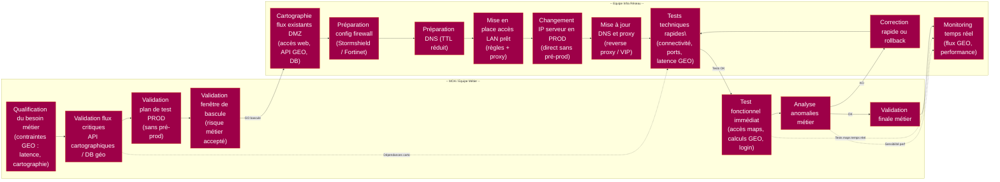

```mermaid
flowchart LR

%% Styles
classDef metier fill:#9d0048,stroke:#f57f17,color:#ffffff,font-size:32px;
classDef infra fill:#9d0048,stroke:#f57f17,color:#ffffff,font-size:32px;

%% Swimlane Métier
subgraph METIER [-- MOA / Equipe Métier --]
    M1["Qualification du besoin métier\n(contraintes GEO : latence, cartographie)"]:::metier
    M2["Validation flux critiques\nAPI cartographiques / DB géo"]:::metier
    M3["Validation plan de test PROD\n(sans pré-prod)"]:::metier
    M4["Validation fenêtre de bascule\n(risque métier accepté)"]:::metier
    M5["Test fonctionnel immédiat\n(accès maps, calculs GEO, login)"]:::metier
    M6["Analyse anomalies métier"]:::metier
    M7["Validation finale métier"]:::metier
end

%% Swimlane Infra
subgraph INFRA [-- Equipe Infra Réseau --]
    I1["Cartographie flux existants DMZ\n(accès web, API GEO, DB)"]:::infra
    I2["Préparation config firewall\n(Stormshield / Fortinet)"]:::infra
    I3["Préparation DNS (TTL réduit)"]:::infra
    I4["Mise en place accès LAN prêt\n(règles + proxy)"]:::infra
    I5["Changement IP serveur en PROD\n(direct sans pré-prod)"]:::infra
    I6["Mise à jour DNS et proxy\n(reverse proxy / VIP)"]:::infra
    I7["Tests techniques rapides\(connectivité, ports, latence GEO)"]:::infra
    I8["Monitoring temps réel\n(flux GEO, performance)"]:::infra
    I9["Correction rapide ou rollback"]:::infra
end

%% Workflow
M1 --> M2 --> M3 --> M4
M4 -->|GO bascule| I1

I1 --> I2 --> I3 --> I4 --> I5 --> I6 --> I7

I7 -->|Tests OK| M5
M5 --> M6

M6 -->|OK| M7
M6 -->|KO| I9

I9 --> I7
M7 --> I8

%% Dépendances GEO
M2 -.->|Dépendances carto| I7
M5 -.->|Tests maps temps réel| I8
M6 -.->|Sensibilité perf| I8
```