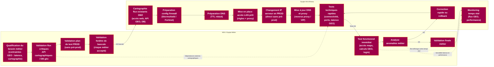

```mermaid
flowchart LR

%% Styles
classDef metier fill:#9d0048,stroke:#f57f17,color:#fff,stroke-width:2px,font-size:24px,font-weight:bold;
classDef infra fill:#9d0048,stroke:#f57f17,color:#fff,stroke-width:2px,font-size:24px,font-weight:bold;
classDef decision fill:#ffd54f,stroke:#f57f17,color:#000,stroke-width:2px,font-size:24px,font-weight:bold;

classDef StartEndPoint  fill:#c40466,stroke:#000,color:#fff,stroke-width:2px,font-size:32px,font-weight:bold;
    classDef Decision       fill:#ffd54f,stroke:#f57f17,color:#000,stroke-width:2px,font-size:24px,font-weight:bold;
    classDef Action         fill:#9d0048,stroke:#f57f17,color:#fff,stroke-width:2px,font-size:24px,font-weight:bold;
    classDef Error          fill:#e53935,stroke:#b71c1c,color:#fff,stroke-width:2px,font-size:24px,font-weight:bold;

%% Swimlane Métier (MOA)
subgraph METIER [MOA / Equipe Métier]
    M1["Qualification du besoin métier\n(contraintes GEO : latence, cartographie)"]:::metier
    M2["Validation flux critiques\nAPI cartographiques / DB géo"]:::metier
    M3["Validation plan de test PROD (sans pré-prod)"]:::metier
    M4["Validation fenêtre de bascule\n(risque métier accepté)"]:::metier
    M5["Test fonctionnel immédiat\n(accès maps, calculs GEO, login)"]:::metier
    M6[Analyse anomalies métier]:::metier
    M7[Validation finale métier]:::metier
end

%% Swimlane Infra
subgraph INFRA [Equipe Infra Réseau]
    I1["Cartographie flux existants DMZ\n(accès web, API GEO, DB)"]:::infra
    I2["Préparation config firewall\n(Stormshield / Fortinet)"]:::infra
    I3["Préparation DNS (TTL réduit)"]:::infra
    I4["Mise en place accès LAN prêt\n(règles + proxy)"]:::infra
    I5["Changement IP serveur en PROD\n(direct sans pré-prod)"]:::infra
    I6["Mise à jour DNS et proxy\n(reverse proxy / VIP)"]:::infra
    I7["Tests techniques rapides\n(connectivité, ports, latence GEO)"]:::infra
    I8["Monitoring temps réel\n(flux GEO, performance)"]:::infra
    I9[Correction rapide ou rollback]:::infra
end

%% Workflow principal
M1 --> M2 --> M3 --> M4
M4 -->|GO bascule| I1

I1 --> I2 --> I3 --> I4 --> I5 --> I6 --> I7

I7 -->|Tests OK| M5
M5 --> M6

M6 -->|OK| M7
M6 -->|KO| I9

I9 --> I7
M7 --> I8

%% Contraintes GEO
M2 -.->|Dépendances externes cartographiques| I7
M5 -.->|Test affichage cartes temps réel| I8
M6 -.->|Sensibilité latence et performance| I8
```