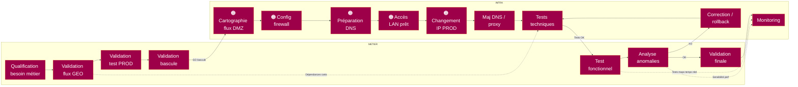

```mermaid
flowchart LR

%% Styles
classDef metier fill:#9d0048,stroke:#f57f17,color:#ffffff,font-size:32px;
classDef infra fill:#9d0048,stroke:#f57f17,color:#ffffff,font-size:32px;

subgraph METIER
    M1["Qualification besoin métier"]:::metier
    M2["Validation flux GEO"]:::metier
    M3["Validation test PROD"]:::metier
    M4["Validation bascule"]:::metier
    M5["Test fonctionnel"]:::metier
    M6["Analyse anomalies"]:::metier
    M7["Validation finale"]:::metier
end

subgraph INFRA
    I1["🟠 Cartographie flux DMZ"]:::infra
    I2["🟠 Config firewall"]:::infra
    I3["🟠 Préparation DNS"]:::infra
    I4["🟠 Accès LAN prêt"]:::infra
    I5["🟠 Changement IP PROD"]:::infra
    I6["Maj DNS / proxy"]:::infra
    I7["Tests techniques"]:::infra
    I8["Monitoring"]:::infra
    I9["Correction / rollback"]:::infra
end

%% Workflow
M1 --> M2 --> M3 --> M4
M4 -->|GO bascule| I1

I1 --> I2 --> I3 --> I4 --> I5 --> I6 --> I7

I7 -->|Tests OK| M5
M5 --> M6

M6 -->|OK| M7
M6 -->|KO| I9

I9 --> I7
M7 --> I8

%% Dépendances GEO
M2 -.->|Dépendances carto| I7
M5 -.->|Tests maps temps réel| I8
M6 -.->|Sensibilité perf| I8
```