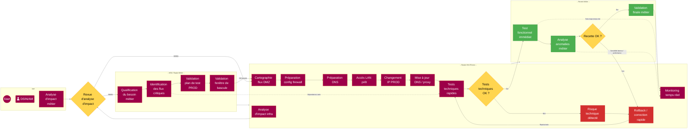

```mermaid
flowchart LR

%% Styles
classDef metier fill:#9d0048,stroke:#f57f17,color:#ffffff,font-size:32px;
classDef infra fill:#9d0048,stroke:#f57f17,color:#ffffff,font-size:32px;
classDef recette fill:#4caf50,stroke:#2e7d32,color:#ffffff,font-size:32px;
classDef decision fill:#ffd54f,stroke:#f57f17,color:#000000,font-size:32px;
classDef risk fill:#d32f2f,stroke:#b71c1c,color:#ffffff,font-size:32px;
subgraph start 
start((Start)):::metier ==> AM
    AM(fa:fa-user DSIN/AM):::metier -->M0
end 
%% Bloc Métier
subgraph METIER [-- MOA / Equipe Métier --]
    direction TB
    M0["Analyse d'impact métier"]:::metier
    M1["Qualification du besoin métier"]:::metier
    M2["Identification des flux critiques"]:::metier
    M3["Validation plan de test PROD"]:::metier
    M4["Validation fenêtre de bascule"]:::metier

end

%% Bloc Infra
subgraph INFRA [-- Equipe Infra Réseau --]
    direction TB
    I0["Analyse d'impact infra"]:::infra
    I1["Cartographie flux DMZ"]:::infra
    I2["Préparation config firewall"]:::infra
    I3["Préparation DNS"]:::infra
    I4["Accès LAN prêt"]:::infra
    I5["Changement IP PROD"]:::infra
    I6["Mise à jour DNS / proxy"]:::infra
    I7["Tests techniques rapides"]:::infra
    D1{"Tests techniques OK ?"}:::decision
    R1["Risque technique détecté"]:::risk
    I9["Rollback / correction rapide"]:::risk
    I8["Monitoring temps réel"]:::infra
end
D0{"Revue d'analyse d'impact"}:::decision
%% Bloc Recette
subgraph RECETTE [-- Recette Métier --]
    direction LR
    M5["Test fonctionnel immédiat"]:::recette
    M6["Analyse anomalies métier"]:::recette
    D2{"Recette OK ?"}:::decision
    M7["Validation finale métier"]:::recette
end

%% Ordonnancement visuel
METIER --> INFRA --> RECETTE
linkStyle 0 opacity:0
linkStyle 1 opacity:0

%% Workflow Métier
M0 --> D0 -- Validée --> M1 --> M2 --> M3 --> M4
M4 -->|GO bascule| I1

%% Workflow Infra
I0 --> D0 -- Validée --> I1 --> I2 --> I3 --> I4 --> I5 --> I6 --> I7 --> D1

%% Décision technique
D1 -->|Oui| M5
D1 -->|Non| R1
R1 --> I9
I9 -->|Reprise tests| I7

%% Workflow Recette
M5 --> M6 --> D2
D2 -->|Oui| M7
D2 -->|Non| I9

%% Mise en production stabilisée
M7 --> I8

%% Dépendances GEO
M2 -.->|Dépendances carto| I7
M5 -.->|Tests maps temps réel| I8
M6 -.->|Sensibilité latence / performance| I8
```