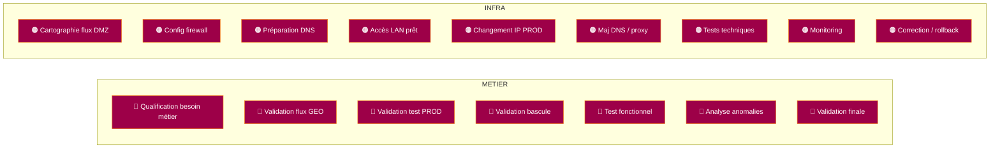

```mermaid
flowchart LR

%% Pas de font-size (ioDraw friendly)
classDef metier fill:#9d0048,stroke:#f57f17,color:#ffffff;
classDef infra fill:#9d0048,stroke:#f57f17,color:#ffffff;

subgraph METIER
    M1["🔷 Qualification besoin métier"]:::metier
    M2["🔷 Validation flux GEO"]:::metier
    M3["🔷 Validation test PROD"]:::metier
    M4["🔷 Validation bascule"]:::metier
    M5["🔷 Test fonctionnel"]:::metier
    M6["🔷 Analyse anomalies"]:::metier
    M7["🔷 Validation finale"]:::metier
end

subgraph INFRA
    I1["🟠 Cartographie flux DMZ"]:::infra
    I2["🟠 Config firewall"]:::infra
    I3["🟠 Préparation DNS"]:::infra
    I4["🟠 Accès LAN prêt"]:::infra
    I5["🟠 Changement IP PROD"]:::infra
    I6["🟠 Maj DNS / proxy"]:::infra
    I7["🟠 Tests techniques"]:::infra
    I8["🟠 Monitoring"]:::infra
    I9["🟠 Correction / rollback"]:::infra
end

```