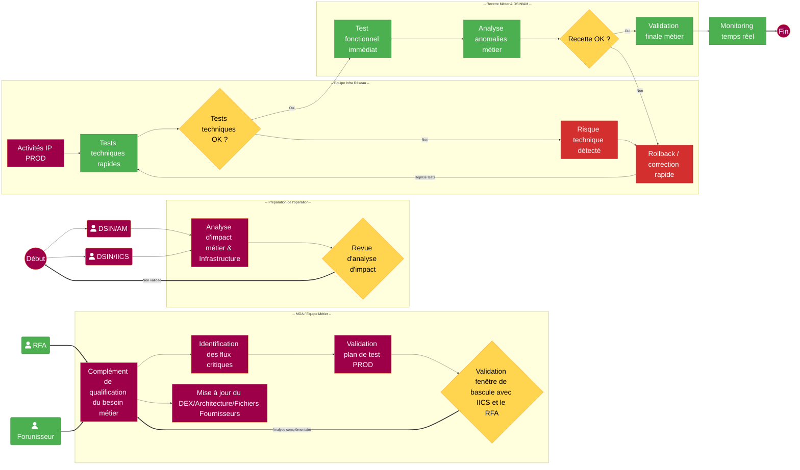

```mermaid
flowchart LR

%% Styles
classDef metier fill:#9d0048,stroke:#f57f17,color:#ffffff,font-size:32px;
classDef infra fill:#9d0048,stroke:#f57f17,color:#ffffff,font-size:32px;
classDef recette fill:#4caf50,stroke:#2e7d32,color:#ffffff,font-size:32px;
classDef decision fill:#ffd54f,stroke:#f57f17,color:#000000,font-size:32px;
classDef risk fill:#d32f2f,stroke:#b71c1c,color:#ffffff,font-size:32px;


%% START complètement externe
START((Début)):::metier
AM(fa:fa-user DSIN/AM):::metier
IICS(fa:fa-user DSIN/IICS):::infra

START --> AM
START --> IICS


%% Subgraph Préparation
subgraph PREPARATION [-- Préparation de l'opération--]
    direction TB
    S0["Analyse d'impact métier & Infrastructure"]:::metier
    D0{"Revue d'analyse d'impact"}:::decision
end

RFA(fa:fa-user RFA):::recette
RFA ==> M1
SELLER(fa:fa-user Forunisseur):::recette
SELLER==> M1
%% Connexions vers le subgraph
AM --> S0
IICS --> S0
S0 --> D0

%% Boucle retour vers START
D0 ==> |Non validée| START

%% Passage vers suite
%%D0 -->|Validée| M1
%%D0 -->|Validée| I1

%% Bloc Métier
subgraph METIER [-- MOA / Equipe Métier --]
    direction TB
    M1["Complément de qualification du besoin métier"]:::metier
    M2["Identification des flux critiques"]:::metier
    M3A["Mise à jour du DEX/Architecture/Fichiers Fournisseurs"]:::metier
    M3["Validation plan de test PROD"]:::metier
    D3{"Validation fenêtre de bascule avec IICS et le RFA"}:::decision
end

%% Bloc Infra
subgraph INFRA [-- Equipe Infra Réseau --]
    direction TB
   %% I1["Cartographie flux DMZ"]:::infra
   %% I2["Préparation config firewall"]:::infra
   %% I3["Préparation DNS"]:::infra
   %% I4["Accès LAN prêt"]:::infra
    I5["Activités IP PROD"]:::infra
   %% I6["Mise à jour DNS / proxy"]:::infra
    I7["Tests techniques rapides"]:::recette
    D1{"Tests techniques OK ?"}:::decision
    R1["Risque technique détecté"]:::risk
    I9["Rollback / correction rapide"]:::risk
   
end
FIN((Fin)):::metier 
I8["Monitoring temps réel"]:::recette ==> FIN

%% Bloc Recette
subgraph RECETTE [-- Recette Métier & DSIN/AM --]
    direction LR
    M5["Test fonctionnel immédiat"]:::recette
    M6["Analyse anomalies métier"]:::recette
    D2{"Recette OK ?"}:::decision
    M7["Validation finale métier"]:::recette
end

%% Ordonnancement visuel
%%PREPARATION --> METIER 
%%PREPARATION --> INFRA 
%%METIER --> RECETTE
%%INFRA --> RECETTE


%% Workflow Métier
M1 --> M2 --> M3 --> D3
M1 --> M3A
%% D3 -->|GO bascule| I1
D3 ==> |Analyse complémentaire| M1

%% Workflow Infra
%%I1 --> I2 --> I3 --> I4 --> I5 --> I6 --> I7 --> D1
 I5 --> I7 --> D1
%% Décisions
D1 -->|Oui| M5
D1 -->|Non| R1
R1 --> I9
I9 -->|Reprise tests| I7

%% Recette
M5 --> M6 --> D2
D2 -->|Oui| M7
D2 -->|Non| I9

%% Run stabilisé
M7 --> I8

%% Dépendances GEO
%%M2 -.->|Dépendances carto| I7
%%M5 -.->|Tests maps temps réel| I8
%%M6 -.->|Sensibilité latence| I8
```