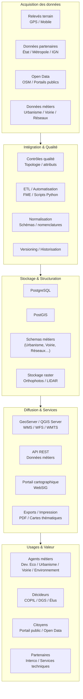

```mermaid
flowchart TD

    %% --- Acquisition ---
    subgraph ACQ["Acquisition des données"]
        A1["Relevés terrain<br/>GPS / Mobile"]
        A2["Données partenaires<br/>État / Métropole / IGN"]
        A3["Open Data<br/>OSM / Portails publics"]
        A4["Données métiers<br/>Urbanisme / Voirie / Réseaux"]
    end

    %% --- Intégration ---
    subgraph INT["Intégration & Qualité"]
        B1["Contrôles qualité<br/>Topologie / attributs"]
        B2["ETL / Automatisation<br/>FME / Scripts Python"]
        B3["Normalisation<br/>Schémas / nomenclatures"]
        B4["Versioning / Historisation"]
    end

    %% --- Stockage ---
    subgraph STO["Stockage & Structuration"]
        C1["PostgreSQL"]
        C2["PostGIS"]
        C3["Schemas métiers<br/>(Urbanisme, Voirie, Réseaux…)"]
        C4["Stockage raster<br/>Orthophotos / LIDAR"]
    end

    %% --- Diffusion ---
    subgraph DIF["Diffusion & Services"]
        D1["GeoServer / QGIS Server<br/>WMS / WFS / WMTS"]
        D2["API REST<br/>Données métiers"]
        D3["Portail cartographique<br/>WebSIG"]
        D4["Exports / Impression<br/>PDF / Cartes thématiques"]
    end

    %% --- Usages ---
    subgraph USA["Usages & Valeur"]
        E1["Agents métiers<br/>Dev. Eco / Urbanisme / Voirie / Environnement"]
        E2["Décideurs<br/>COPIL / DGS / Élus"]
        E3["Citoyens<br/>Portail public / Open Data"]
        E4["Partenaires<br/>Interco / Services techniques"]
    end

    %% --- Flux ---
    ACQ --> INT
    INT --> STO
    STO --> DIF
    DIF --> USA

```