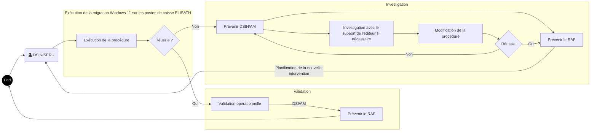

```mermaid
flowchart LR

    Point((Start)) --> A
    classDef startStyle fill:#000,stroke:#000,color:#fff
    class Point startStyle
    A(fa:fa-user DSIN/SERU) --> B[Exécution de la procédure]
    subgraph Exécution de la migration Windows 11 sur les postes de caisse ELISATH
    B --> C{Réussie ?}
    end
    subgraph Validation
        C -- Oui --> D[Validation opérationnelle]
        D -- DSI/AM --> J[Prévenir le RAF]
        
    end
    J --> Point((End)):::startStyle
    subgraph Investigation
        C -- Non --> E[Prévenir DSIN/AM]
        E --> F[Prévenir le RAF]
        E --> G[Investigation avec le support de l'éditeur si nécessaire]
        G --> H[Modification de la procédure]
        H --> I{Réussie}
        I -- Oui --> F
        I -- Non --> E
    end
    F -- Planification de la nouvelle intervention --> A
    
```