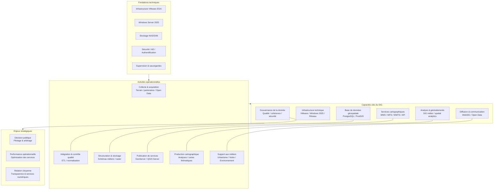

```mermaid
flowchart TB

    %% --- Niveau 1 : Enjeux stratégiques ---
    subgraph STRAT["Enjeux stratégiques"]
        S1["Décision publique<br/>Pilotage & arbitrage"]
        S2["Performance opérationnelle<br/>Optimisation des services"]
        S3["Relation citoyenne<br/>Transparence & services numériques"]
    end

    %% --- Niveau 2 : Capacités clés ---
    subgraph CAPA["Capacités clés du SIG"]
        C1["Gouvernance de la donnée<br/>Qualité / cohérence / sécurité"]
        C2["Infrastructure technique<br/>VMware / Windows 2025 / Réseau"]
        C3["Base de données géospatiale<br/>PostgreSQL / PostGIS"]
        C4["Services cartographiques<br/>WMS / WFS / WMTS / API"]
        C5["Analyse & géotraitements<br/>SIG métier / spatial analytics"]
        C6["Diffusion & communication<br/>WebSIG / Open Data"]
    end

    %% --- Niveau 3 : Activités opérationnelles ---
    subgraph ACT["Activités opérationnelles"]
        A1["Collecte & acquisition<br/>Terrain / partenaires / Open Data"]
        A2["Intégration & contrôle qualité<br/>ETL / normalisation"]
        A3["Structuration & stockage<br/>Schémas métiers / raster"]
        A4["Publication de services<br/>GeoServer / QGIS Server"]
        A5["Production cartographique<br/>Analyses / cartes thématiques"]
        A6["Support aux métiers<br/>Urbanisme / Voirie / Environnement"]
    end

    %% --- Niveau 4 : Ressources & fondations ---
    subgraph FOND["Fondations techniques"]
        F1["Infrastructure VMware ESXi"]
        F2["Windows Server 2025"]
        F3["Stockage NAS/SAN"]
        F4["Sécurité / AD / Authentification"]
        F5["Supervision & sauvegardes"]
    end

    %% --- Flux verticaux (chaîne de valeur) ---
    FOND --> ACT
    ACT --> CAPA
    CAPA --> STRAT

    %% --- Flux transverses ---
    C1 --- A2
    C3 --- A3
    C4 --- A4
    C5 --- A5
    C6 --- A6

```