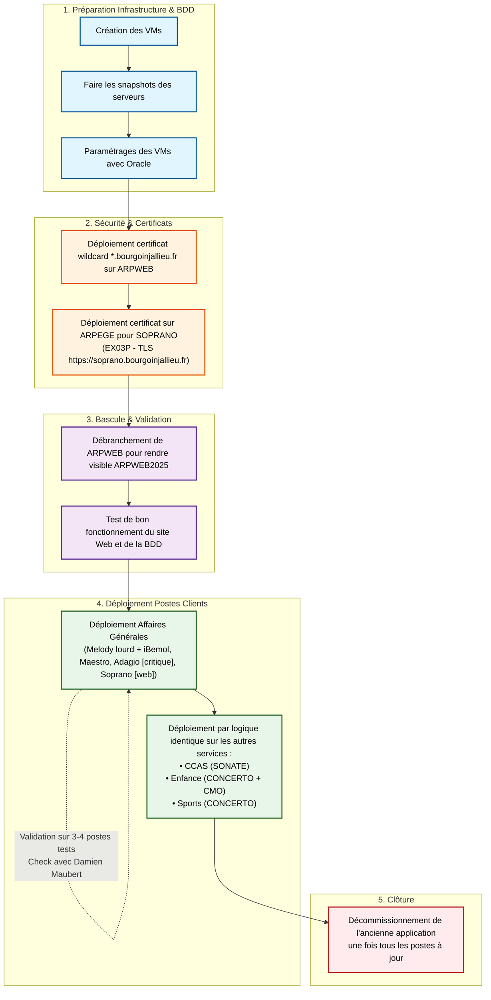

```mermaid
flowchart TD
    %% Définition des styles
    classDef infra fill:#e1f5fe,stroke:#01579b,stroke-width:2px,color:#000
    classDef sec fill:#fff3e0,stroke:#e65100,stroke-width:2px,color:#000
    classDef bascule fill:#f3e5f5,stroke:#4a148c,stroke-width:2px,color:#000
    classDef deploy fill:#e8f5e9,stroke:#1b5e20,stroke-width:2px,color:#000
    classDef endnode fill:#ffebee,stroke:#b71c1c,stroke-width:2px,color:#000

    subgraph Phase1 [1. Préparation Infrastructure & BDD]
        A[Création des VMs]:::infra --> B[Faire les snapshots des serveurs]:::infra
        B --> C[Paramétrages des VMs avec Oracle]:::infra
    end

    subgraph Phase2 [2. Sécurité & Certificats]
        C --> D[Déploiement certificat wildcard *.bourgoinjallieu.fr sur ARPWEB]:::sec
        D --> E["Déploiement certificat sur ARPEGE pour SOPRANO<br/>(EX03P - TLS https://soprano.bourgoinjallieu.fr)"]:::sec
    end

    subgraph Phase3 [3. Bascule & Validation]
        E --> F[Débranchement de ARPWEB pour rendre visible ARPWEB2025]:::bascule
        F --> G[Test de bon fonctionnement du site Web et de la BDD]:::bascule
    end

    subgraph Phase4 [4. Déploiement Postes Clients]
        G --> H["Déploiement Affaires Générales<br/>(Melody lourd + iBemol, Maestro, Adagio [critique], Soprano [web])"]:::deploy
        H -.->|Validation sur 3-4 postes tests<br/>Check avec Damien Maubert| H
        H --> I["Déploiement par logique identique sur les autres services :<br/>• CCAS (SONATE)<br/>• Enfance (CONCERTO + CMO)<br/>• Sports (CONCERTO)"]:::deploy
    end

    subgraph Phase5 [5. Clôture]
        I --> J[Décommissionnement de l'ancienne application<br/>une fois tous les postes à jour]:::endnode
    end

  
```