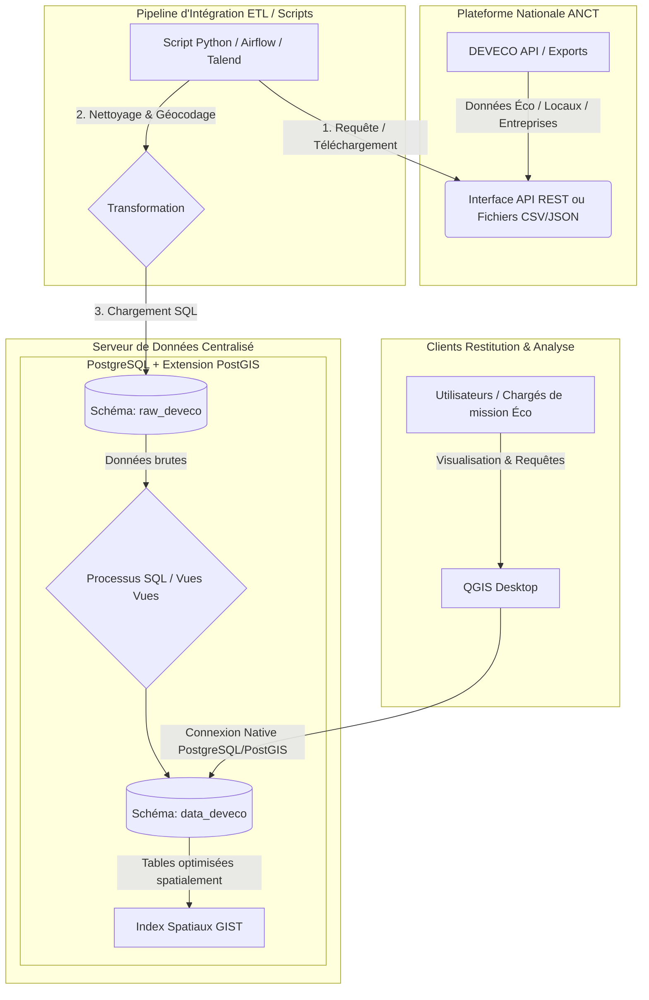

```mermaid
graph TD
    %% Couche Sources de Données
    subgraph Source ["Plateforme Nationale ANCT"]
        A[DEVECO API / Exports] -->|Données Éco / Locaux / Entreprises| B(Interface API REST ou Fichiers CSV/JSON)
    end

    %% Couche Extraction & Transformation
    subgraph ETL ["Pipeline d'Intégration ETL / Scripts"]
        C[Script Python / Airflow / Talend] -->|1. Requête / Téléchargement| B
        C -->|2. Nettoyage & Géocodage| D{Transformation}
    end

    %% Couche Stockage
    subgraph Stockage ["Serveur de Données Centralisé"]
        direction TB
        subgraph Postgres ["PostgreSQL + Extension PostGIS"]
            E[(Schéma: raw_deveco)] -->|Données brutes| F{Processus SQL / Vues Vues}
            F --> G[(Schéma: data_deveco)]
            G -->|Tables optimisées spatialement| H[Index Spatiaux GIST]
        end
    end

    %% Couche Restitution
    subgraph Restitution ["Clients Restitution & Analyse"]
        I[QGIS Desktop] -->|Connexion Native PostgreSQL/PostGIS| G
        J[Utilisateurs / Chargés de mission Éco] -->|Visualisation & Requêtes| I
    end

    %% Flux de données principaux
    D -->|3. Chargement SQL| E

```