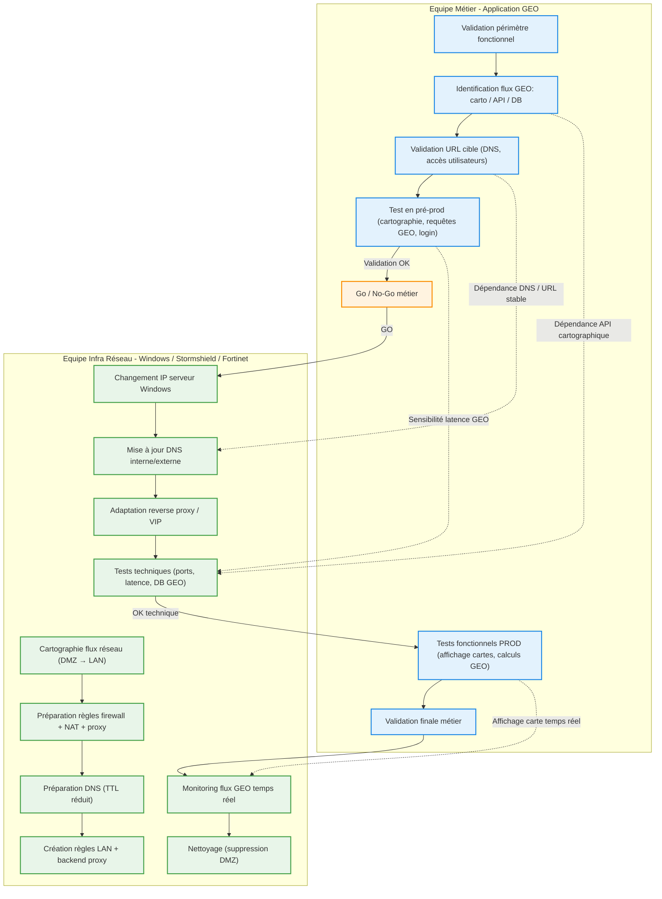

```mermaid
flowchart TD
%% Définition des styles
classDef metier fill:#E3F2FD,stroke:#1E88E5,stroke-width:2px;
classDef infra fill:#E8F5E9,stroke:#43A047,stroke-width:2px;
classDef decision fill:#FFF3E0,stroke:#FB8C00,stroke-width:2px;
%% Swimlane Metier
subgraph METIER [Equipe Métier - Application GEO]
    M1[Validation périmètre fonctionnel]:::metier
    M2[Identification flux GEO: carto / API / DB]:::metier
    M3["Validation URL cible (DNS, accès utilisateurs)"]:::metier
    M4["Test en pré-prod (cartographie, requêtes GEO, login)"]:::metier
    M5[Go / No-Go métier]:::decision
    M6["Tests fonctionnels PROD (affichage cartes, calculs GEO)"]:::metier
    M7[Validation finale métier]:::metier
end
%% Swimlane Infra
subgraph INFRA [Equipe Infra Réseau - Windows / Stormshield / Fortinet]
    I1["Cartographie flux réseau (DMZ → LAN)"]:::infra
    I2[Préparation règles firewall + NAT + proxy]:::infra
    I3["Préparation DNS (TTL réduit)"]:::infra
    I4[Création règles LAN + backend proxy]:::infra
    I5[Changement IP serveur Windows]:::infra
    I6[Mise à jour DNS interne/externe]:::infra
    I7[Adaptation reverse proxy / VIP]:::infra
    I8["Tests techniques (ports, latence, DB GEO)"]:::infra
    I9[Monitoring flux GEO temps réel]:::infra
    I10["Nettoyage (suppression DMZ)"]:::infra
end
%% Workflow parallèle + synchronisation
M1 --> M2 --> M3 --> M4
I1 --> I2 --> I3 --> I4
M4 -->|Validation OK| M5
M5 -->|GO| I5
I5 --> I6 --> I7 --> I8
I8 -->|OK technique| M6
M6 --> M7
M7 --> I9 --> I10
%% Contraintes spécifiques GEO annotations
M2 -.-> |Dépendance API cartographique| I8
M3 -.-> |Dépendance DNS / URL stable| I6
M4 -.-> |Sensibilité latence GEO| I8
M6 -.-> |Affichage carte temps réel| I9

```